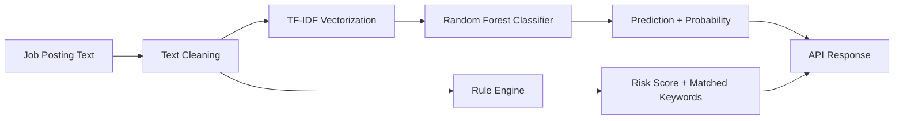

# Fake Job Detector

[](https://www.python.org/)
[](https://fastapi.com/)
[](https://streamlit.io/)
[](https://scikit-learn.org/)
[](https://www.docker.com/)
[](https://render.com/)
[](LICENSE.md)

A full-stack machine learning application that detects fraudulent job postings. Paste or upload a job description and receive an instant verdict with fraud probability, confidence score, rule-based risk signals, and interactive analytics — powered by a Random Forest classifier trained on 17,880 real-world job listings.

---

## Live Demo

**Try the deployed application:**

### [https://fake-job-detector-app-qa6q.onrender.com/](https://fake-job-detector-app-qa6q.onrender.com/)

> **Note:** The app runs on Render's free tier. The backend API may take up to ~30 seconds to wake from sleep on the first request after inactivity.

---

## Features

- **Machine learning job classification** — Random Forest + TF-IDF pipeline classifies postings as Real or Fake
- **Fraud probability score** — Percentage likelihood that a posting is fraudulent (0–100%)
- **Confidence score** — Model confidence for the predicted class
- **Rule-based risk engine** — Keyword matching across four threat categories: payment, contact, urgency, and salary
- **Composite risk score** — Weighted score derived from matched rule categories (+30 / +20 / +15 / +10)
- **Frontend heuristic red-flag detection** — Regex-based pattern matching for common scam signals (e.g., unrealistic salary claims, no-interview offers, MLM language)
- **Interactive Streamlit dashboard** — Three-page UI: Detector Panel, Analytics Console, and System Status
- **Risk visualizations** — Plotly gauge chart, pie chart, and histogram
- **Sample job templates** — Pre-filled legitimate and high-risk posting examples for quick testing
- **File upload support** — Analyze job postings from `.txt` and `.md` files
- **Input validation** — Enforces 20–10,000 character limits on job text
- **Prediction history API** — `GET /history` retrieves the last 50 predictions from MySQL when configured
- **Analytics console** — Filterable prediction logs with verdict distribution and probability histograms
- **FastAPI REST API** — JSON endpoints for prediction, health checks, and history
- **Health endpoint** — Reports API status, database logging state, and model directory path
- **Docker support** — Containerized deployment with a shared Dockerfile for both services
- **Render deployment** — Blueprint (`render.yaml`) for two-service production deployment

---

## Tech Stack

### Frontend
- [Streamlit](https://streamlit.io/) — Interactive web dashboard
- [Plotly](https://plotly.com/python/) — Gauge, pie, and histogram charts
- [Requests](https://requests.readthedocs.io/) — HTTP client for API communication

### Backend
- [FastAPI](https://fastapi.com/) — REST API framework
- [Uvicorn](https://www.uvicorn.org/) — ASGI server
- [Pydantic](https://docs.pydantic.dev/) — Request/response validation

### Machine Learning
- [scikit-learn](https://scikit-learn.org/) — Random Forest classifier, TF-IDF vectorizer, train/test split
- [imbalanced-learn](https://imbalanced-learn.org/) — SMOTE oversampling for class imbalance
- [Pandas](https://pandas.pydata.org/) — Data loading and preprocessing
- [NumPy](https://numpy.org/) — Numerical operations
- [Joblib](https://joblib.readthedocs.io/) — Model serialization

### Database
- [MySQL](https://www.mysql.com/) — Optional prediction history storage (via `mysql-connector-python`)

### DevOps
- [Docker](https://www.docker.com/) — Containerization
- [Render](https://render.com/) — Cloud deployment

### Version Control
- [Git](https://git-scm.com/)
- [GitHub](https://github.com/)

---

## Project Structure

```
fake-job-detector/
├── app.py                      # Streamlit frontend (FraudScan AI dashboard)
├── main.py                     # FastAPI backend entry point
├── train.py                    # Model training script
├── preprocess.py               # Dataset loading and text cleaning
├── requirements.txt            # Python dependencies
├── Dockerfile                  # Docker image definition
├── render.yaml                 # Render deployment blueprint
├── .env.example                # Environment variable template
├── LICENSE.md                  # MIT License
│
├── data/
│   └── fake_job_postings.csv   # Training dataset (17,880 rows)
│
├── model/
│   ├── tfidf_vectorizer.pkl    # Saved TF-IDF vectorizer
│   └── random_forest_model.pkl # Saved Random Forest classifier
│
├── models/
│   └── schemas.py              # Pydantic request/response models
│
├── services/
│   ├── predictor.py            # Prediction pipeline (ML + rules)
│   ├── rules.py                # Keyword-based risk rule engine
│   └── database.py             # MySQL connection helpers
│
└── utils/
    └── text.py                 # Text cleaning utilities
```

---

## Installation

### Prerequisites

- Python 3.11+
- pip
- (Optional) Docker
- (Optional) MySQL for prediction history

### 1. Clone the repository

```bash
git clone https://github.com/Arya185/fake-job-detector.git
cd fake-job-detector
```

### 2. Create a virtual environment

```bash
python3 -m venv .venv
source .venv/bin/activate        # macOS / Linux
# .venv\Scripts\activate         # Windows
```

### 3. Install dependencies

```bash
pip install -r requirements.txt
```

### 4. Configure environment variables

```bash
cp .env.example .env
```

Edit `.env` as needed (see [Environment Variables](#environment-variables) below).

### 5. Run the backend

```bash
python3 -m uvicorn main:app --host 127.0.0.1 --port 8000 --reload
```

The API will be available at `http://127.0.0.1:8000`. Interactive API docs at `http://127.0.0.1:8000/docs`.

### 6. Run the frontend

In a separate terminal:

```bash
streamlit run app.py
```

The dashboard opens at `http://localhost:8501`.

### 7. (Optional) Retrain the model

```bash
python train.py
```

This loads `data/fake_job_postings.csv`, trains a new Random Forest model, and saves artifacts to `model/`.

---

## Environment Variables

| Variable | Required | Default | Description |
|---|---|---|---|
| `API_BASE_URL` | Frontend only | `http://127.0.0.1:8000` | Base URL of the FastAPI backend (used by Streamlit) |
| `MODEL_DIR` | Backend only | `./model` | Directory containing `tfidf_vectorizer.pkl` and `random_forest_model.pkl` |
| `ENABLE_DB_LOGGING` | No | `false` | Set to `true` to enable MySQL-backed prediction history |
| `MYSQL_HOST` | If DB enabled | — | MySQL server hostname |
| `MYSQL_PORT` | If DB enabled | `3306` | MySQL server port |
| `MYSQL_USER` | If DB enabled | — | MySQL username |
| `MYSQL_PASSWORD` | If DB enabled | `""` | MySQL password |
| `MYSQL_DATABASE` | If DB enabled | — | MySQL database name |

> Database logging requires `ENABLE_DB_LOGGING=true` **and** valid `MYSQL_HOST`, `MYSQL_USER`, and `MYSQL_DATABASE` values. See [Deployment](#deployment) for the required table schema.

---

## API Documentation

Base URL (local): `http://127.0.0.1:8000`

### Endpoints

| Method | Endpoint | Description | Response |
|---|---|---|---|
| `GET` | `/` | Root status check | `{"message": "Fake Job Detector API is running ✅"}` |
| `GET` | `/health` | Health and configuration status | `{"status": "ok", "database_logging": bool, "model_dir": str}` |
| `POST` | `/predict` | Classify a job posting | `PredictionResponse` (see below) |
| `GET` | `/history` | Retrieve last 50 predictions from MySQL | `{"history": [...]}` or disabled/error message |

### `POST /predict`

**Request body:**

```json
{
  "text": "Full job posting description (20–10,000 characters)"
}
```

**Response:**

```json
{
  "prediction": "Fake 🚨",
  "confidence": "97.42%",
  "fraud_probability": 97.42,
  "risk_score": 50,
  "matched_rules": ["payment", "urgency"],
  "matched_keywords": ["registration fee", "urgent hiring"]
}
```

| Field | Type | Description |
|---|---|---|
| `prediction` | `string` | `"Real ✅"` or `"Fake 🚨"` |
| `confidence` | `string` | Model confidence as a percentage |
| `fraud_probability` | `float` | Probability of fraud (0–100) |
| `risk_score` | `int` | Rule-based risk score from keyword matches |
| `matched_rules` | `list[str]` | Matched threat categories |
| `matched_keywords` | `list[str]` | Specific keywords that triggered rules |

<details>
<summary><strong>Example: cURL request</strong></summary>

```bash
curl -X POST http://127.0.0.1:8000/predict \
  -H "Content-Type: application/json" \
  -d '{"text": "URGENTLY HIRING! Work from home, no experience required. Earn $1500/week guaranteed. WhatsApp us to apply immediately!"}'
```

</details>

---

## Machine Learning Pipeline

### Overview



### Dataset

| Property | Value |
|---|---|
| Source | `data/fake_job_postings.csv` |
| Total rows | 17,880 |
| Real postings | 17,014 (95.2%) |
| Fake postings | 866 (4.8%) |
| Label column | `fraudulent` (0 = Real, 1 = Fake) |
| Text fields combined | `title`, `company_profile`, `description`, `requirements`, `benefits` |

### Feature Engineering

1. **Text combination** — Five text columns are concatenated into a single `combined_text` field
2. **Cleaning** (`utils/text.py`):
   - Lowercase conversion
   - HTML tag removal
   - Special characters and numbers stripped
   - Whitespace normalization

### TF-IDF Vectorization

| Parameter | Value |
|---|---|
| `max_features` | 15,000 |
| `ngram_range` | (1, 3) |
| `stop_words` | English |
| `sublinear_tf` | `True` |

### Model

| Parameter | Value |
|---|---|
| Algorithm | Random Forest Classifier |
| `n_estimators` | 200 |
| `max_depth` | 20 |
| `class_weight` | `balanced` |
| Class balancing | SMOTE oversampling on training set |

### Training

```bash
python train.py
```

Training steps:
1. Load and preprocess the dataset
2. 80/20 stratified train/test split (`random_state=42`)
3. Fit TF-IDF vectorizer on training data
4. Apply SMOTE to balance the training set
5. Train Random Forest classifier
6. Evaluate on held-out test set
7. Save `model/tfidf_vectorizer.pkl` and `model/random_forest_model.pkl`

### Prediction Flow

1. User submits job text via Streamlit or `POST /predict`
2. Text is cleaned using the same preprocessing pipeline
3. TF-IDF vectorizer transforms the text
4. Random Forest outputs class label and class probabilities
5. Rule engine scans for keyword matches and computes a risk score
6. Combined result returned to the client
7. Frontend applies additional regex-based heuristic checks for display

### Rule Engine Weights

| Category | Keywords (examples) | Risk Points |
|---|---|---|
| `payment` | registration fee, processing fee, joining fee | +30 |
| `contact` | whatsapp, telegram, dm me | +20 |
| `urgency` | urgent hiring, apply immediately, limited seats | +15 |
| `salary` | earn daily, no experience, work from home | +10 |

---

## Screenshots

| Page | Placeholder |
|---|---|
| Detector Panel - Input |  |
| Detector Panel - Result| |
| Analytics Console |  |
| System Status |  |

---

## Deployment

The project deploys to [Render](https://render.com/) as two separate web services defined in `render.yaml`:

| Service | Name | Command | Port |
|---|---|---|---|
| API | `fake-job-detector-api` | `uvicorn main:app --host 0.0.0.0 --port 10000` | 10000 |
| Frontend | `fake-job-detector-app` | `streamlit run app.py --server.port 10000 --server.address 0.0.0.0` | 10000 |

**Live application:** [https://fake-job-detector-app-qa6q.onrender.com/](https://fake-job-detector-app-qa6q.onrender.com/)

### Render Setup

1. Connect the GitHub repository to Render
2. Render reads `render.yaml` and creates both services automatically
3. The frontend's `API_BASE_URL` is wired to the API service via Render's internal service discovery (`RENDER_EXTERNAL_URL`)
4. `ENABLE_DB_LOGGING` defaults to `false` on the API service

### Docker (Local)

```bash
# Build the image
docker build -t fake-job-detector .

# Run the API
docker run -p 10000:10000 fake-job-detector

# Run the frontend (separate container)
docker run -p 10000:10000 fake-job-detector \
  python -m streamlit run app.py --server.port 10000 --server.address 0.0.0.0 --server.headless true
```

### MySQL Schema (Optional)

If enabling prediction history, create the following table:

```sql
CREATE TABLE predictions (
    id INT AUTO_INCREMENT PRIMARY KEY,
    input_text VARCHAR(500) NOT NULL,
    prediction VARCHAR(50) NOT NULL,
    fraud_probability FLOAT NOT NULL,
    created_at TIMESTAMP DEFAULT CURRENT_TIMESTAMP
);
```

---

## Performance

Metrics measured from the saved model on a held-out 20% test split (`random_state=42`, stratified):

| Metric | Value |
|---|---|
| **Overall accuracy** | 98.41% |
| Real — precision / recall / F1 | 0.98 / 1.00 / 0.99 |
| Fake — precision / recall / F1 | 0.97 / 0.69 / 0.81 |
| Test set size | 3,576 samples |

### Model Configuration

| Parameter | Value |
|---|---|
| Training corpus | 17,880 postings |
| TF-IDF features | 15,000 |
| N-gram range | Unigrams to trigrams |
| Classifier | Random Forest (200 trees, max depth 20) |
| Class balancing | SMOTE on training set |

### Input Constraints

| Constraint | Value |
|---|---|
| Minimum text length | 20 characters |
| Maximum text length | 10,000 characters |
| History API limit | Last 50 predictions |

> **Note:** Fake-class recall (69%) is lower than overall accuracy due to severe class imbalance in the dataset (4.8% fraudulent). Consider this when interpreting borderline predictions.

---

## Contributing

Contributions are welcome. Please follow these steps:

1. **Fork** the repository
2. **Create a feature branch**
   ```bash
   git checkout -b feature/your-feature-name
   ```
3. **Make your changes** — Keep diffs focused and match existing code style
4. **Test locally** — Verify both the API and Streamlit frontend work
5. **Commit** with a clear, descriptive message
6. **Push** to your fork and open a Pull Request

### Development Guidelines

- Do not commit `.env` files or credentials
- Run `python train.py` only when retraining is intentional (it overwrites model artifacts)
- Match existing naming conventions and module structure
- Update this README if you add new endpoints, environment variables, or features

---

## License

This project is licensed under the **MIT License**. See [LICENSE.md](LICENSE.md) for the full text.

---

## Author

**Arya Patel**

- GitHub: [@Arya185](https://github.com/Arya185)
- Repository: [github.com/Arya185/fake-job-detector](https://github.com/Arya185/fake-job-detector)
